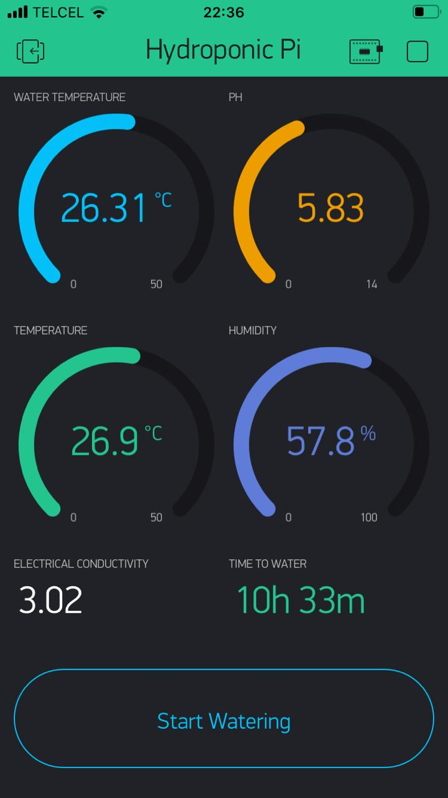
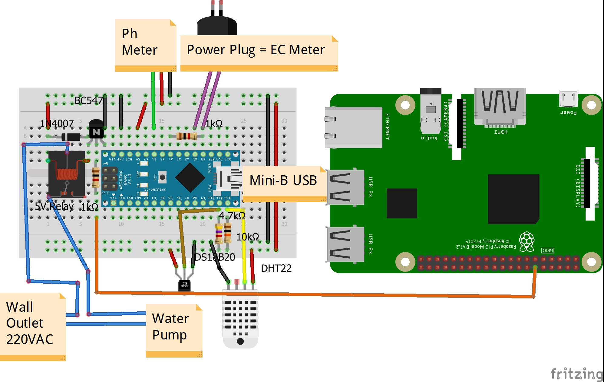

# Hydroponic Pi

#### Project that aims to automate a hydroponic system.

The watering of the plants is being controlled. The Ph, electrical conductivity, and temperature of the water are being monitored, as well as the humidity and temperature of the environment.  
An Arduino is used to read from the sensors and write the data to the serial port, it is mainly used because the RPi lacks analog inputs. The RPi then takes care of everything else.  
The plants are only watered between sunrise and sunset, [suncalc](https://github.com/mourner/suncalc) library makes the calculations based on the date, latitude and longitude. Then the pump turns on for 15 minutes and off for 45.  
The data is being displayed using the [Blynk](https://blynk.io/) app, where the water pump can also be controlled.  

## Hardware

### List of Materials

| Amount | Part Type                             |
| ------ | ------------------------------------- |
| 1      | Raspberry Pi                          |
| 1      | Arduino Nano                          |
| 1      | 4.7kΩ Resistor                        |
| 2      | 1kΩ Resistor                          |
| 1      | 10kΩ Resistor                         |
| 1      | 1N4007 Diode                          |
| 1      | BC547 NPN Transistor                  |
| 1      | DS18B20 1-Wire Temperature Sensor     |
| 1      | DHT22 Humidity and Temperature Sensor |
| 1      | 5V Relay                              |
| 1      | Power Plug                            |
| 1      | Ph Meter                              |

### Circuit

## Arduino Code

-   Install [platformio](https://platformio.org/) and make sure it's added to your path
-   Run `pio lib install` to install the dependencies
-   Build the code with `pio run`
-   Build and Upload it with `pio run -t upload`

## Raspberry Pi Code

-   Install [nodejs](https://nodejs.org/en/)
-   Run `npm install` to install the dependencies
-   `npm start` runs the code

To execute the code on boot, copy the unit file to the systemd folder and give it permissions:  
`sudo cp hydroponicpi.service /etc/systemd/system/hydroponicpi.service`  
`sudo chmod 644 /etc/systemd/system/hydroponicpi.service`  
Then ensure that the service starts when the system boots:  
`sudo systemctl enable hydroponicpi`
